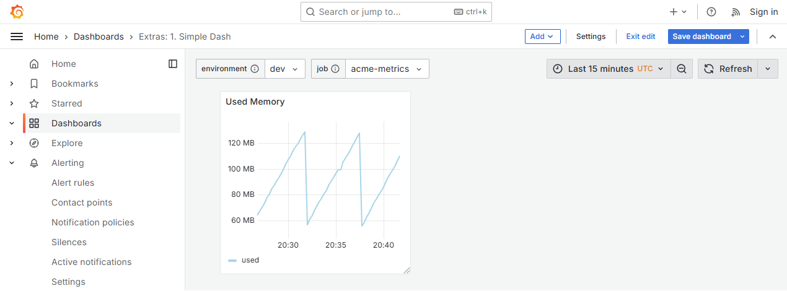
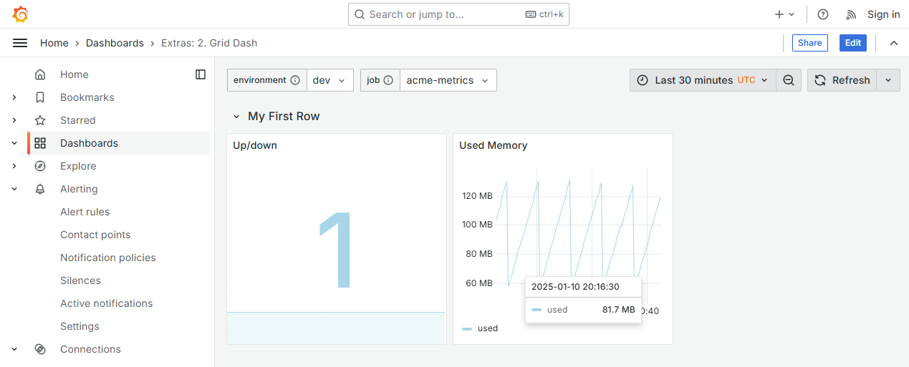
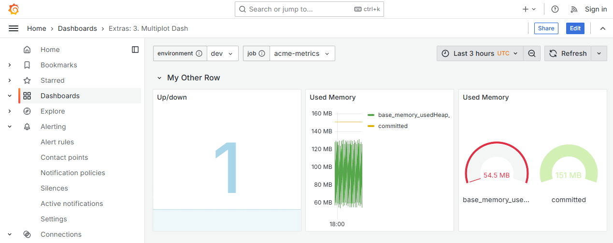

 # Examples

## 1-simple-dash.jsonnet

What this does
- introduces a `grafonnet-extras` plot that defines a query
- introduces a panel that a plot can be added to
- render a dashboard with a timeSeries panel

Things to note
- the query in the plot is your normal grafana query
- the plot specifies a datasource that will process the query
- a panel can have more than 1 plot attached to it
- the panel is placed 1 grid unit away from the left margin

What next
- plots can be defined in separate files so they can be reused in various dashboards
- try changing the type attribute in the panel, say, from `timeSeries` to `stat`, or `heatmap`
- panels can be sized and positioned independently using `geometry` hints

## 2-grid-dash.jsonnet

What this does
- introduces multiple panels in a dashboard
- render panels in a grid layout

Things to note
- with a grid, panels get laid out one row at a time (each row is 24 units wide)
- each panel in this example is set to 8 units wide
- a plot can be visualised in different panels
- the first panel is placed right at left margin

What next
- plots can be defined in separate files so they can be reused in various dashboards
- duplicate the "Used Memory" timeSeries and change the type of the copy to `gauge` (now it's easy to compare usability)

## 3-multi-plots.jsonnet

What this does
- render panels with multiple plots
- Configure plots with settings

Things to note
- a plot can be visualised in different panels
- a palette is provided to display plots in different colours

What next
- thresholds, overrides, mappings and transformations

----

[grafonnet-extras](../README.md).